# Dairy Farm

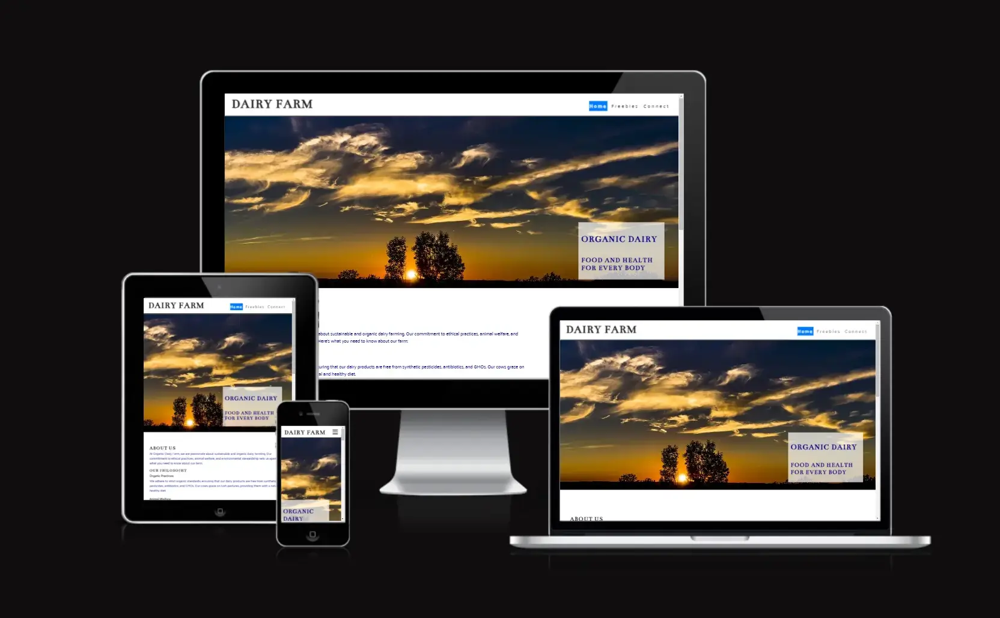  

Discover the authentic flavor of genuine dairy products, brought to you directly from our pasture-raised cows. At Dairy Farm, we prioritize organic farming methods that prioritize the welfare and contentment of our animals. This dedication guarantees the production of the finest and most delectable milk and dairy products available, ensuring a truly exceptional experience for your taste buds.  

Responsive visual <b style="color: yellow;">(open here)</b>

<!-- Change code from 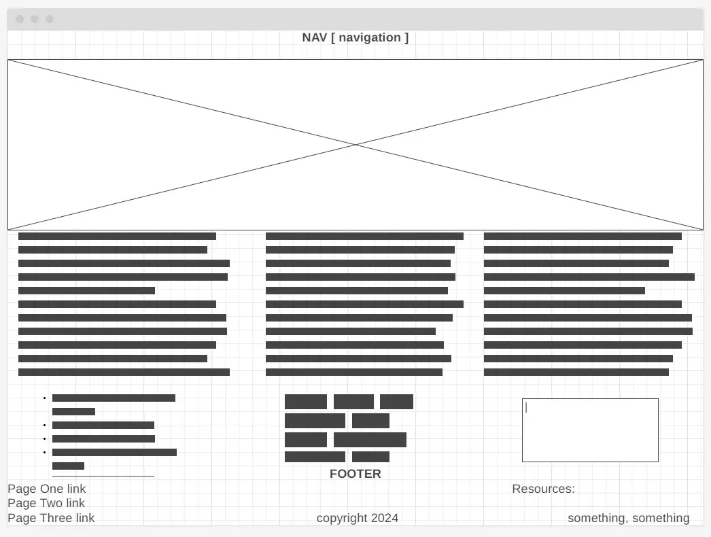 -->
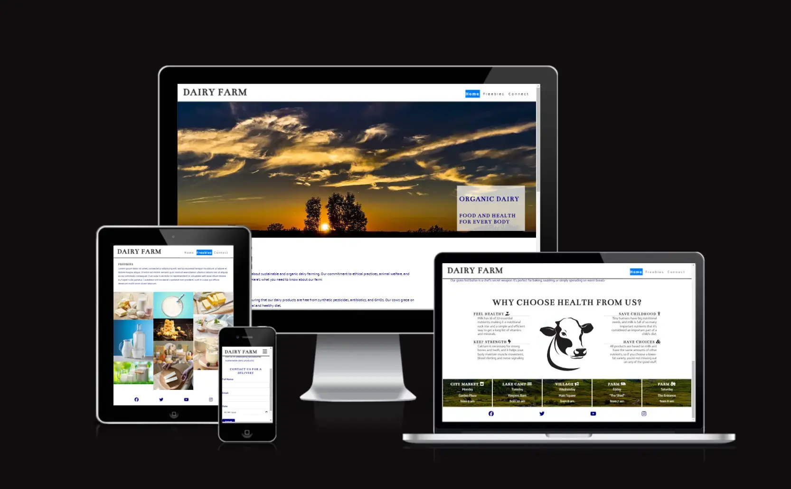

Live site is on the location: **https://silver25.github.io/organic-dairy-farm/**

-----

## Introduction

The purpose of this project is to build a responsive website using pure HTML and CSS.  

Currently, the Project is for educational purposes only and without any relation to eventual existing real-life similarities. The website's content is specifically aimed at the urban population, with a strong emphasis on the relationship between farming and family, as well as the introduction of healthy products.. Users will be able to navigate through the website using a functional navigation bar that will take them to different sections of the website.  

User goals:
- goal
- goal
- goal  

Business goals:
- goal
- goal
- goal  

User Stories:
1. story
2. story
3. story
4. story
5. story

The main sections include  
- Home page with About content
- Freebies page with free content visitors can download
- Connect page  

**Technologies Used:**
- HTML: The markup language used to structure the content of the webpage.
- CSS: The stylesheet language used to style the visual presentation of the webpage.

Each section provides specific content or functionality as follows...  

-----

## Visual Presentation

## Wireframes

Wireframe for desktop visual <b style="color: yellow;">(open here)</b>

<!-- Change code from  -->

Wireframes for mobile visual <b style="color: yellow;">(open here)</b>

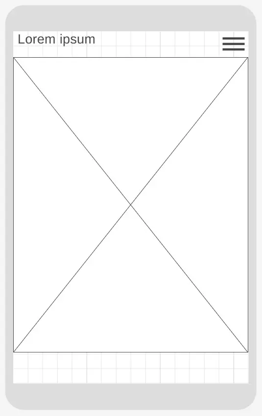
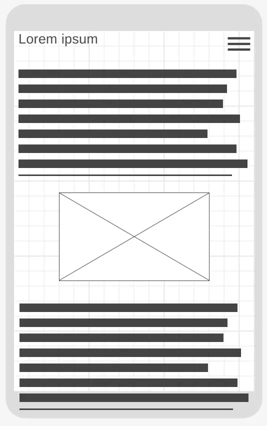
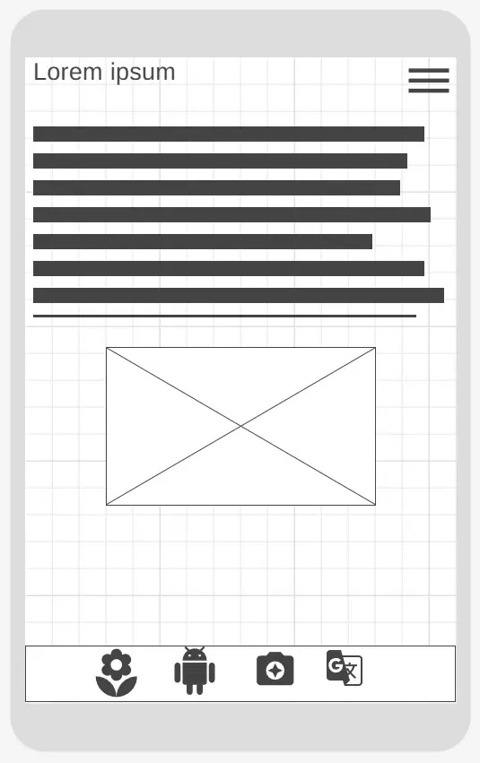
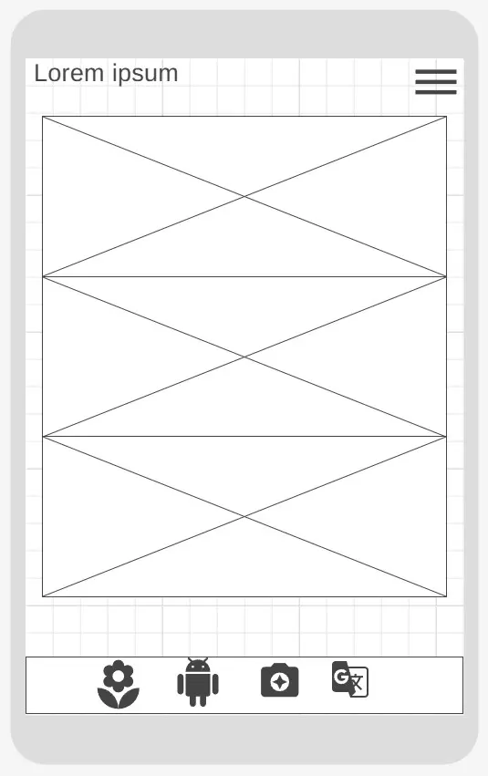
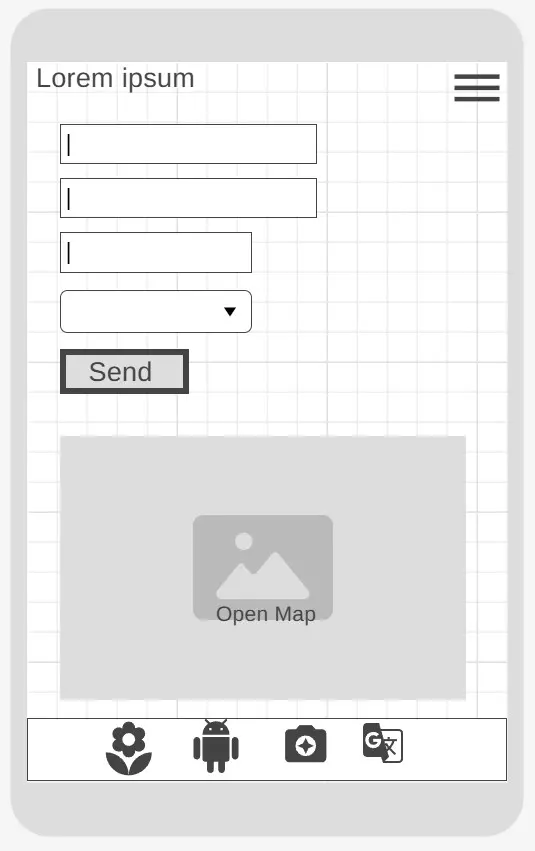

### Fonts

### Colours

### Icons

### Images

## Present Features Across the Project

- Landing (Home) page
- Navigation Bar
- The Hero Image with Tagline
  - Website tagline is a short phrase that helps people understand what this website or company does or specializes in. Taglines are still relevant and are important for helping people understand website content, particularly when they’re not familiar with presenter.
- About Me Section
- The Footer
- Connect

-----

## Future Features on Stand-by

1. [_] Implementation of Map with street view on Connect page. 
2. [_] Adding responsive logo image in top navigation section of header, in front of title . 
3. [_] Slider/Carousel responsive Hero image changer on landing page.
4. [_] Blog/Tutorial section with sugestions how-to-do farming.  
5. [_] Web shop for online ordering of goods presented as product per page.
6. [_] Extra information in the Footer section (links, contact details, copyright, etc.)

-----

## Testing

### Manual Testing

Error caused by missing heading <b style="color: yellow;">(open here)</b>

Error in code validation repaired with adding one H2 heading in code and then hidden with proper styling

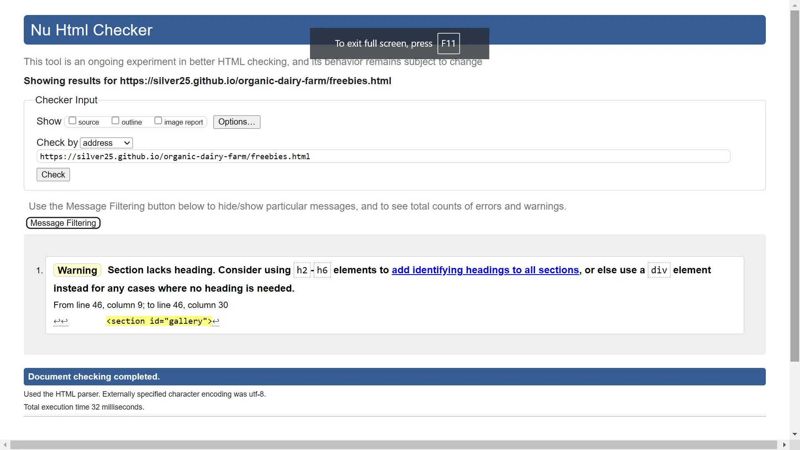

  

Error caused by wrong font value <b style="color: yellow;">(open here)</b>

Error in CSS code validation fixed with removing wrong line from code.

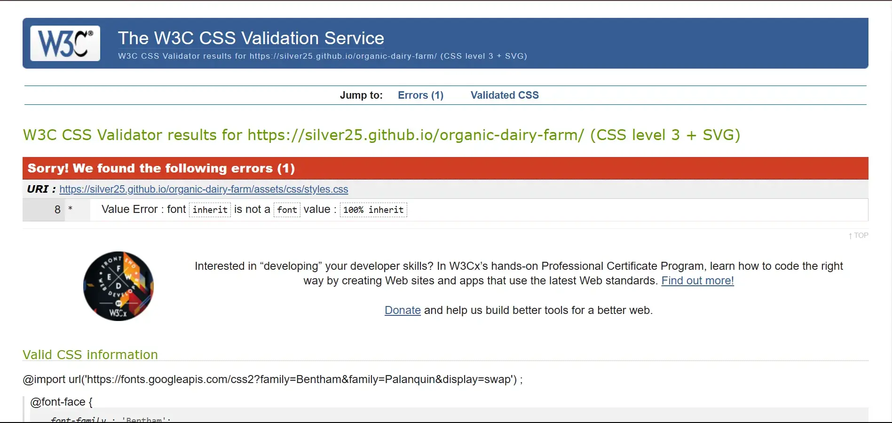

  

Display issue with formating <b style="color: yellow;">(open here)</b>

Error with the proper formating of the images in the gallery because of the missed action to reload the page, ignoring cached content. 
In this case just missed proper refreshing of the browser

-----

### Validator Testing

W3C HTML Validator: https://validator.w3.org/

Validation of Index.html page <b style="color: yellow;">(open here)</b>

Online validation tool check HTML code by input of URL from where website is deployed.

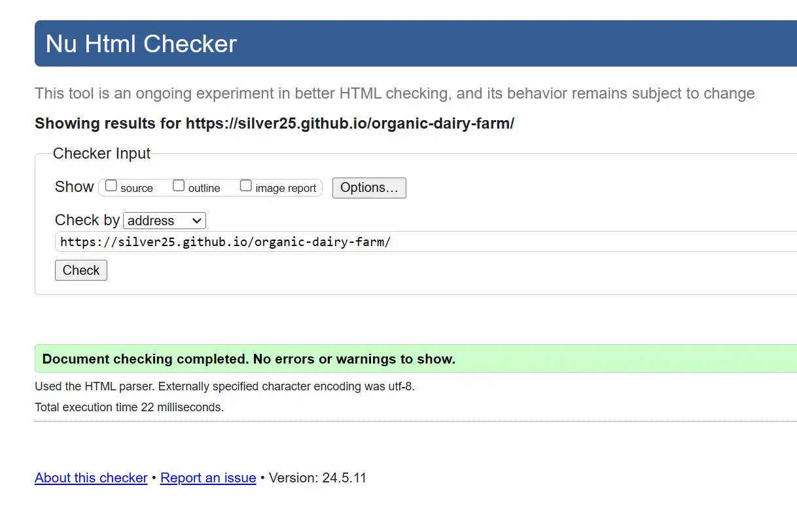

Validation of Index.html code <b style="color: yellow;">(open here)</b>

Online validation tool check HTML code by input of clean code in text-input area.

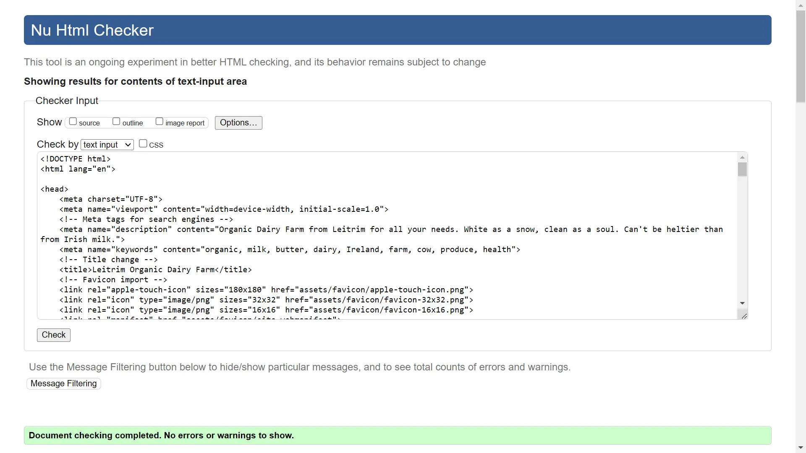

Validation of Freebies.html page <b style="color: yellow;">(open here)</b>

Online validation tool check HTML code by input of URL from where website is deployed.

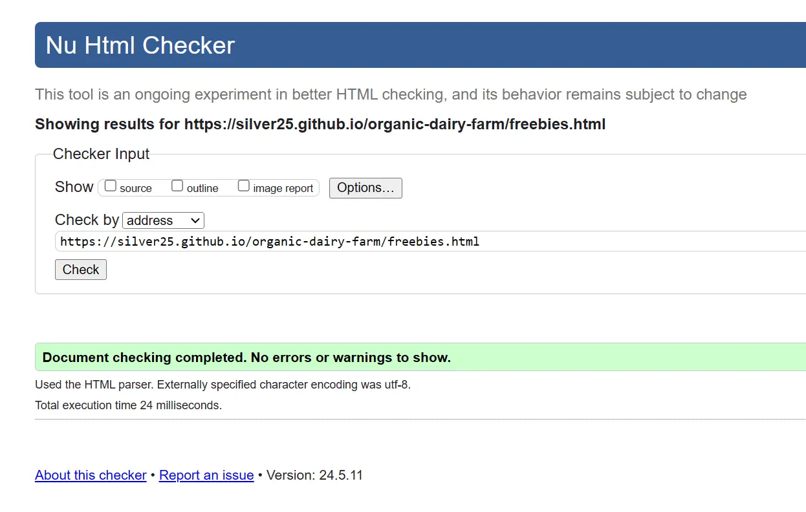

Validation of Freebies.html code <b style="color: yellow;">(open here)</b>

Online validation tool check HTML code by input of clean code in text-input area.

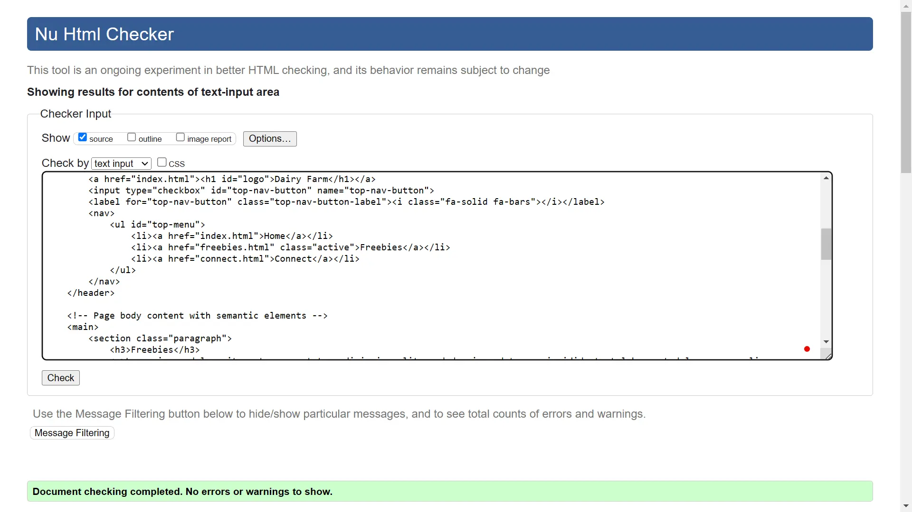

Validation of Connect.html page <b style="color: yellow;">(open here)</b>

Online validation tool check HTML code by input of URL from where website is deployed.

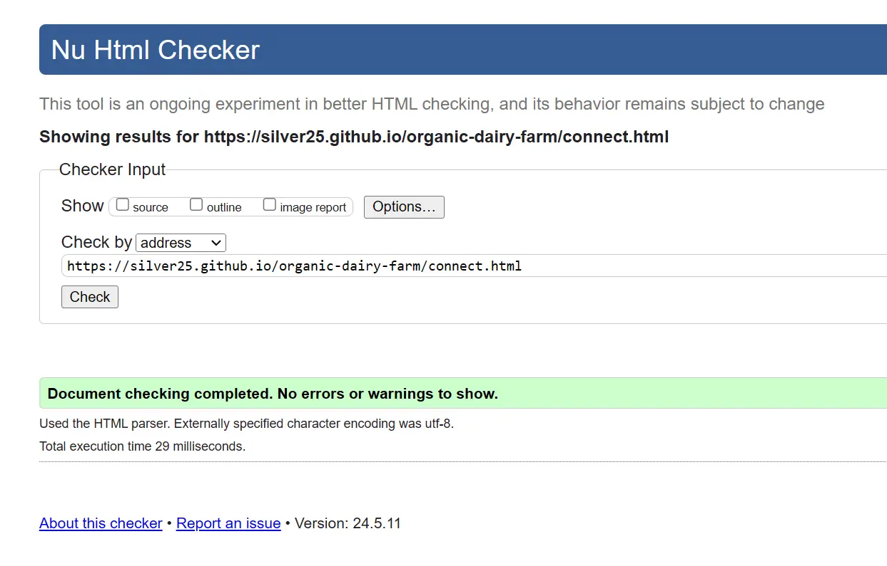

Validation of Connect.html code <b style="color: yellow;">(open here)</b>

Online validation tool check HTML code by input of clean code in text-input area.

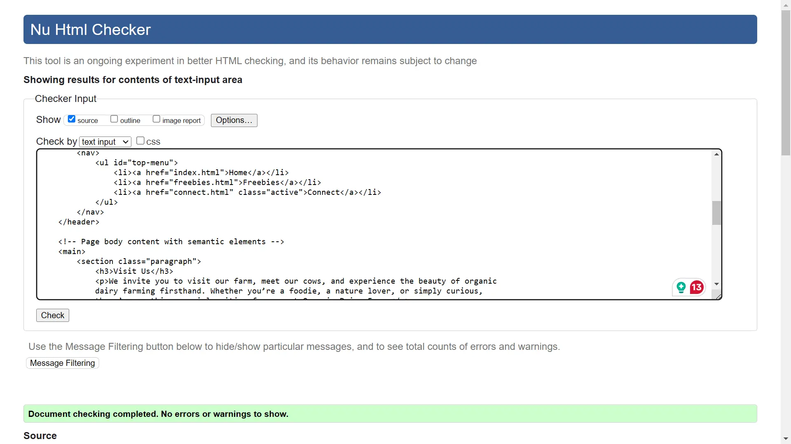

-----

W3C CSS Validator: https://jigsaw.w3.org/css-validator

Validation of styles.css code <b style="color: yellow;">(open here)</b>

Online validation tool check CSS code by input of clean code in text-input area.

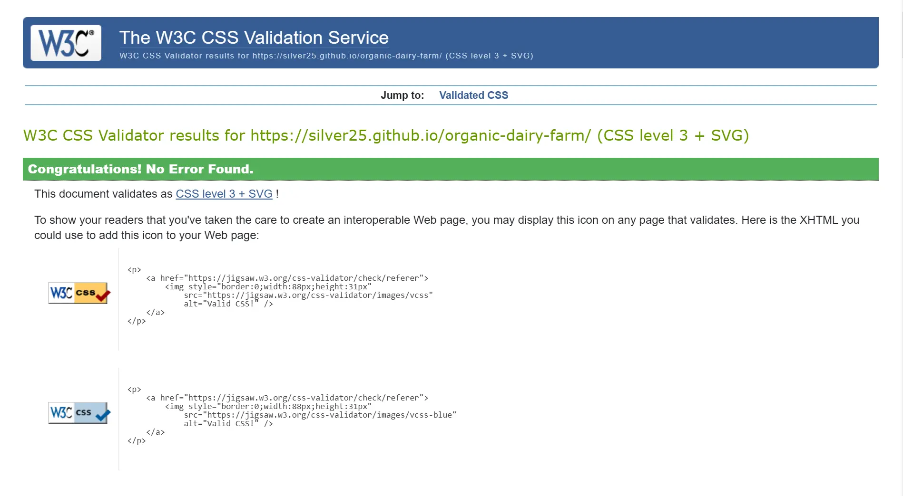

-----

Lighthouse Audit tool: https://pagespeed.web.dev/  
Responsive Design: https://ui.dev/amiresponsive

-----

### Issues to be fixed

-----

## Deployment

### Local Deployment

To test and view HTML5 and CSS3 project locally, a simple server environment needs to be set up on personal computer. This essentially mimics a web hosting service, but runs on private machine. Let's walk through the steps involved...  
- Choose a code editor of your preference like Visual Studio Code, Sublime Text, Atom, or Brackets. These editors provide syntax highlighting and other functionalities for web development.
- Organize your HTML and CSS files in a *folder structure*. Typically, you'll have an index.html file as your main webpage and other HTML files for different sections. CSS files can be in a separate CSS folder. All together can be placed in the *My Documents* subfolder on Windows.
- As HTML and CSS are languages easily interpreted in the browser of choice, once index.html file is created it's content can be displayed opening that file in browser
- For everything to work and display properly attention needs to be on using of *relative path* code structure
- Test the layout and functionality on different browsers (*Portable Browsers*).
- Use the browser's developer tools (*Inspect* or **F12**) to inspect and debug any styling issues.

Or to simplify if Repository for the project is already created on GitHub all content of the project can be downloaded over the action button and option "Download".

GitGub option to download full project in once <b style="color: yellow;">(open here)</b>

If all of the changes are saved (CTRL+S) and content updated on GitHub (git push) download of full project is available over green button "Code" and option "Download ZIP"

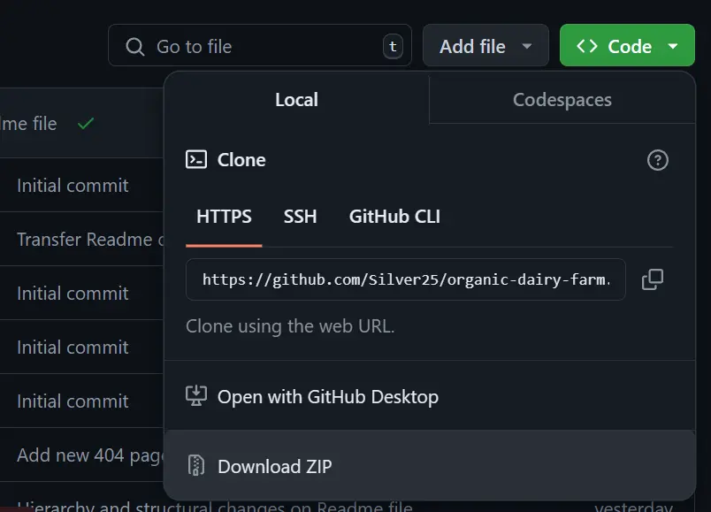

-----

### Cloud Deployment

Live site is on the location: *https://silver25.github.io/organic-dairy-farm/*

-----

## Credits

For the fast or more detailed explanation of some part of the code resources to consult:
- https://www.w3schools.com/
- https://css-tricks.com/
- https://developer.mozilla.org/en-US/docs/Web
- https://web.dev/

Used images for Index page  
- Hero image: horizon.jpg = by Felix Mittermeier on https://pxhere.com  
- Cow head below paragraphs = by jod67 from https://istock.com  
- Timetables bgr image: panoramic.jpg = Open source image from https://publicdomainpictures.net  
- Cow head on 404 page = by jamesjames2541 from https://istock.com
- Icons from https://fontawesome.com/v4/icons/ 

Used images for the Freebies page  
- dairy-products.jpg = https://www.health.harvard.edu  
- milk-in-glass.jpg = https://www.forbes.com  
- organic-milk.jpg = https://www.thefrozengarden.com  
- milkshake.jpg = https://www.eatingwell.com  
- cheese.jpg = https://www.healthline.com/nutrition/healthiest-cheese  
- cheese-pile.jpg = https://www.gq.com/story/the-surprising-health-benefits-of-cheese  
- butter-plate.jpg = https://blog.providence.org/regional-blog-news  
- sour-cream.jpg = https://www.realsimple.com  
- soften-butter.jpg = https://cravingcork.ie  
- yogurt.jpg = https://cookidoo.co.uk/  
  
### Text Tools

- Make use of [Google Translate](https://translate.google.com/) online service for translation from Croatian to English language and spelling check.  
- Run text through [AI Paragraph Rewriter](https://ahrefs.com/writing-tools/paragraph-rewriter) online tool to accomplish formal style of writing for translations.  
- Use of the [Grammarly](https://app.grammarly.com/) tool for guidance around the content.  
- Help with basic writing and formatting syntax for this file with help of the [GitHub](https://docs.github.com/)
- Google Font pairing tool (Fonts that go together): [Fontpair](https://www.fontpair.co/all)

### Image Tools

Conversion of the images from JPG file format to WEBP file format:  
- using portable Windows software [IrfanView](https://www.irfanview.com/) with plugin WEBP - (version 4.63, allows IrfanView to read/write WEBP (Weppy Format) files)  
- using online tool [FreeConvert](https://www.freeconvert.com/jpg-to-webp)  

Other Image manipulation tools:
- Creation of Intro display image: https://ui.dev/amiresponsive
- Portable Windows software [IrfanView](https://www.irfanview.com/) for fast transformation
- Wireframe actions accomplished with online tools https://mydraft.cc/ and https://wireframe.cc/
- [Favicon](https://favicon.io) generator

I would like to express gratitude to **[Code Institute](https://codeinstitute.net/ie/)** and **Love Running** project for offering a valuable step-by-step guide that was instrumental in creating the basis for this website.  
Last but not least is big THANKS to my mentor **Rory** for guidance and sugestions through project.

-----

<!-- ########## Gitpod Reminders ##########

To run a frontend (HTML, CSS, Javascript only) application in Gitpod, in the terminal, type:

`python3 -m http.server` [ blue button to click: _Open Browser_. ]
Ctrl + C

$ git add .
$ git commit -m "Description of changes in code"
$ git push
$ git status
$ clear
  
-->