# Dairy Farm

  

Discover the authentic flavor of genuine dairy products, brought to you directly from our pasture-raised cows. At Dairy Farm, we prioritize organic farming methods that prioritize the welfare and contentment of our animals. This dedication guarantees the production of the finest and most delectable milk and dairy products available, ensuring a truly exceptional experience for your taste buds.  

Responsive visual <b style="color: yellow;">(open here)</b>

<!-- Change code from  -->

Live site is on the location: **https://silver25.github.io/organic-dairy-farm/**

-----

## Introduction

The purpose of this project is to build a responsive website using pure HTML and CSS.  

Currently, the Project is for educational purposes only and without any relation to eventual existing real-life similarities. The website's content is specifically aimed at the urban population, with a strong emphasis on the relationship between farming and family, as well as the introduction of healthy products.. Users will be able to navigate through the website using a functional navigation bar that will take them to different sections of the website.  

User goals:
- goal
- goal
- goal  

Business goals:
- goal
- goal
- goal  

User Stories:
1. story
2. story
3. story
4. story
5. story

The main sections include  
- Home page with About content
- Freebies page with free content visitors can download
- Connect page  

**Technologies Used:**
- HTML: The markup language used to structure the content of the webpage.
- CSS: The stylesheet language used to style the visual presentation of the webpage.

-----

## Visual Presentation

## Wireframes

Wireframe for desktop visual <b style="color: yellow;">(open here)</b>

<!-- Change code from  -->

Wireframes for mobile visual <b style="color: yellow;">(open here)</b>

### Fonts

### Colours

### Icons

### Images

## Present Features across the Project

Each section provides specific content or functionality as follows...

Top navigation bar through all pages <b style="color: yellow;">(open here)</b>

Navigation on top of all pages with Title as a link on left side and navigation links adapted for desktop and mobile screens on the right.

 
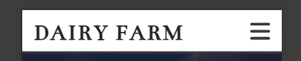

The Hero Image with Tagline only on landing page <b style="color: yellow;">(open here)</b>

Website tagline is a short phrase that helps people understand what this website or company does or specializes in. Taglines are still relevant and are important for helping people understand website content, particularly when they’re not familiar with presenter.

 
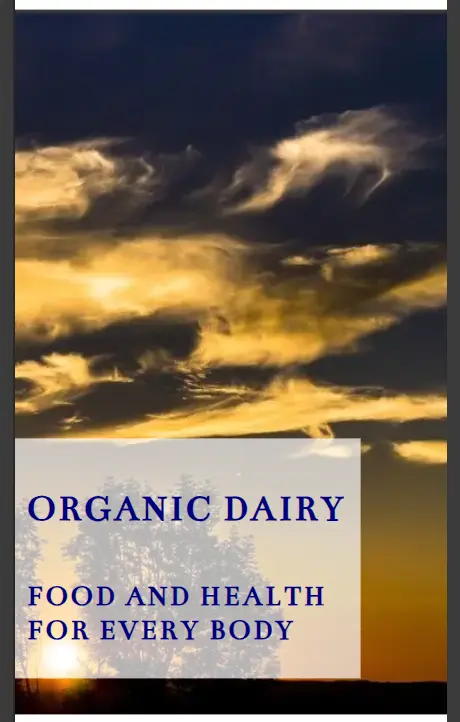

About Us info text section only on landing page <b style="color: yellow;">(open here)</b>

Landing (Home) page text with presenting basic information about business and services.

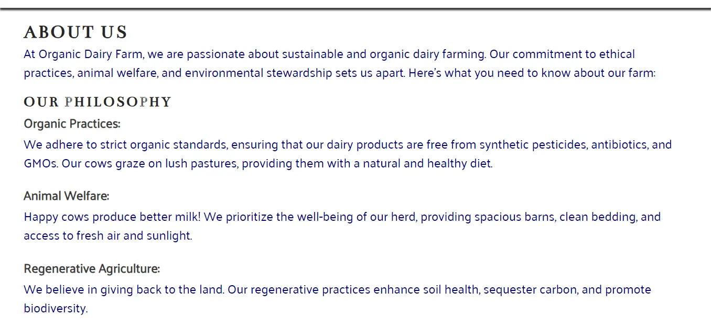 

Grouped info text boxes only on landing page <b style="color: yellow;">(open here)</b>

Landing (Home) page text with accent on benefits of using business services.

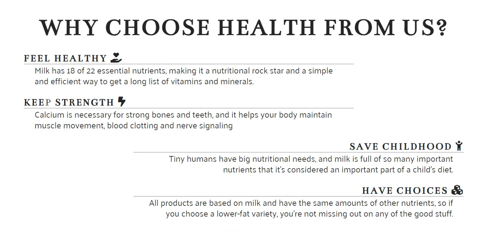 
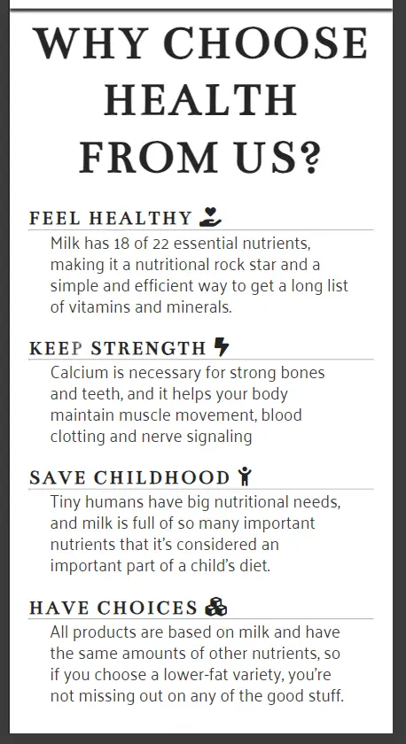

Visual as text breaker only on landing page <b style="color: yellow;">(open here)</b>

Landing (Home) page image of cow with role as refreshment between block of text and related to the business services.

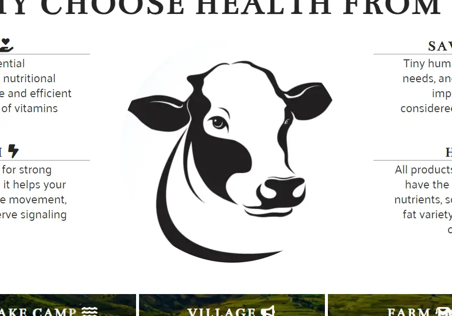 
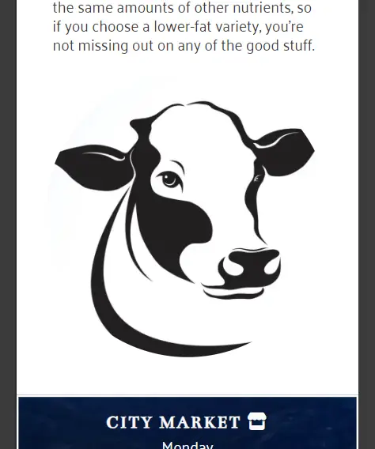

Timetable only on landing page <b style="color: yellow;">(open here)</b>

Landing (Home) page Timetable or working locations presented as a blocks of text and related to the business working hours and location where services are offered.

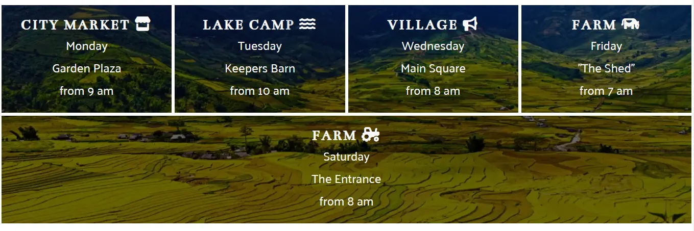 
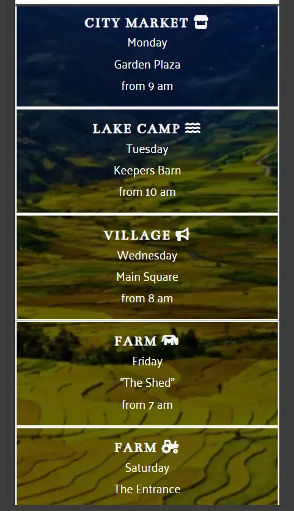

Footer icons through all pages <b style="color: yellow;">(open here)</b>

Social Media icons as a links to every particular online service, opening in the new tab/window and placed in the Footer of every page.

 
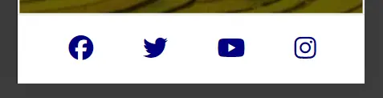

Free stuff intro text on Freebies page <b style="color: yellow;">(open here)</b>

Intro informative text about free stuff which are in ofer over the links to visitors. Feature available only on Freebies page.

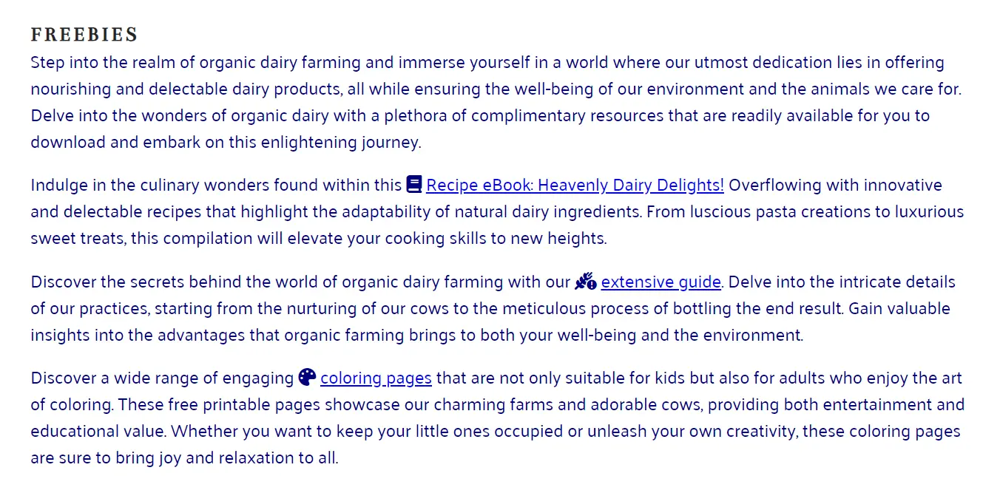 

Image gallery on Freebies page <b style="color: yellow;">(open here)</b>

Gallery of images which represents products in offer from business.

 
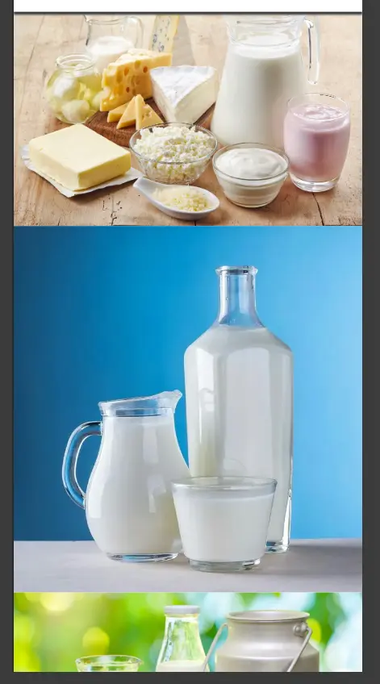

Contact form on Connect page <b style="color: yellow;">(open here)</b>

A contact form on web page of business provides a convenient and secure way for visitors to reach, boosting lead generation and user trust. Contact form only on Connect page.

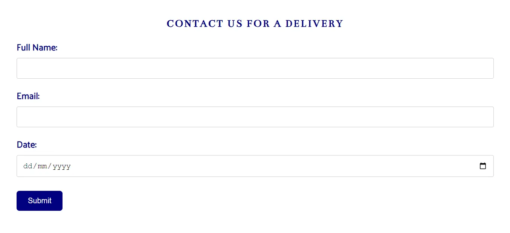 
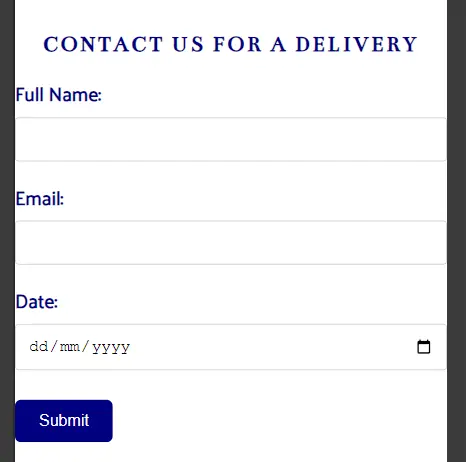

- 404 Error customized page

-----

## Future Features on Stand-by

1. [_] Implementation of Map with street view on Connect page. 
2. [_] Adding responsive logo image in top navigation section of header, in front of title . 
3. [_] Slider/Carousel responsive Hero image changer on landing page.
4. [_] Blog/Tutorial section with sugestions how-to-do farming.  
5. [_] Web shop for online ordering of goods presented as product per page.
6. [_] Extra information in the Footer section (links, contact details, copyright, etc.)
7. [_] Light/dark mode toggle

-----

## Testing

### Manual Testing

The process of manually testing a website can be as straightforward as accessing a web page or application in a controlled environment, manually navigating through a series of predetermined test scenarios, and recording the outcomes of each test on a spreadsheet. This initial approach is commonly adopted by software teams when they initially prioritize quality assurance.

Basic knowledge of HTML elements and CSS properties is helpful in identifying potential issues and fixing them. 

Testing process was continuously applied through the time of building the website. 
- Browsers used for cross-browser compatibility and responsiveness:
  - Chrome as the primary development tool
  - Edge, Opera, Brave, Min, SlimJet, Falkon and Iron
- Devices used for testing purposes: 
  - desktop devices with Windows 10 and 11 OS were used, from 11" to 15" screen size
  - tablet devices were unavailable, option with browser Dev Tools applied
  - mobile devices were Nokia X10, Samsung Galaxy M13, Samsung Galaxy A10 and Samsung Galaxy J6 (as obsolete device)

**Testing Process:**
- *Tested Content*: Before adding actual content, inserted some test content into HTML file and run it in web browser to ensure that the code is working as expected.
- *User Interface (UI)*: Verified the layout, visual design, and overall user experience. Checked for consistent formatting, proper image loading, and readability across different screen sizes.
- *Readability*: Examined displayed text (font family, font size, color contrast).
- *Navigation*: Tested all navigation elements like menus, buttons, and links. Ensured they lead to the correct destination pages and function smoothly.
- *Forms & Functionality*: Tested form (contact) to be sure it submit data correctly, provide clear error messages for invalid inputs, and follow expected functionalities, sending data.
- *Content Accuracy*: Reviewed all website content for accuracy, grammar, and spelling mistakes. Verified that descriptions and other information are up-to-date and consistent.
- *Responsiveness*: Validated responsiveness of the website loading Dev Tools option of split screen and resized the browser window across different browsers.
  
| Functionality | Expectation | Grade |
|--------------|-------------------------|------|
| visual style | how it looks in browser | pass |
| logo text | link to landing page | pass |
| navigation | are all links working | pass |
| grafics | visibility of all images | pass |
| font type | how fonts are presented | pass |
| linked text | accurate text links | pass |
| position | where elements are positioned | pass|
| bgr images | how bgr elements are displayed | pass |
| reaction | will particular elements react as expected | pass |
| footer | are elements visible | pass |
| footer | are elements functional | pass |
| form | is it form displayed as expected | pass |
| form | are form functions working | pass |
| 404 | is page approachable | pass |

Error caused by missing heading <b style="color: yellow;">(open here)</b>

Error in code validation repaired with adding one H2 heading in code and then hidden with proper styling

  

Error caused by wrong font value <b style="color: yellow;">(open here)</b>

Error in CSS code validation fixed with removing wrong line from code.

  

Display issue with formating <b style="color: yellow;">(open here)</b>

Error with the proper formating of the images in the gallery because of the missed action to reload the page, ignoring cached content. 
In this case just missed proper refreshing of the browser

### Tests to apply

- *Accessibility*: Test the website's accessibility features for users with disabilities. Check for proper keyboard navigation, screen reader compatibility, and clear alternative text descriptions for images.

-----

### Validator Testing

W3C HTML Validator: https://validator.w3.org/

Validation of Index.html page <b style="color: yellow;">(open here)</b>

Online validation tool check HTML code by input of URL from where website is deployed.

Validation of Index.html code <b style="color: yellow;">(open here)</b>

Online validation tool check HTML code by input of clean code in text-input area.

Validation of Freebies.html page <b style="color: yellow;">(open here)</b>

Online validation tool check HTML code by input of URL from where website is deployed.

Validation of Freebies.html code <b style="color: yellow;">(open here)</b>

Online validation tool check HTML code by input of clean code in text-input area.

Validation of Connect.html page <b style="color: yellow;">(open here)</b>

Online validation tool check HTML code by input of URL from where website is deployed.

Validation of Connect.html code <b style="color: yellow;">(open here)</b>

Online validation tool check HTML code by input of clean code in text-input area.

Validation of Error 404.html page <b style="color: yellow;">(open here)</b>

Online validation tool check HTML code by input of URL from where website is deployed.

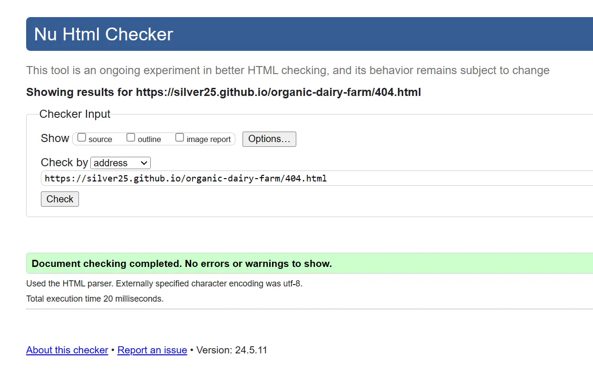

-----

W3C CSS Validator: https://jigsaw.w3.org/css-validator

Validation of styles.css code <b style="color: yellow;">(open here)</b>

Online validation tool check CSS code by input of clean code in text-input area.

-----

Lighthouse in Chrome DevTools

Lighthouse is an open-source, automated Audit tool for improving the quality of web pages. You can run it against any web page, public or requiring authentication. It has audits for performance, accessibility, progressive web apps, SEO, and more. Lighthouse is integrated directly into the Chrome DevTools, under the "Lighthouse" panel.

Lighthouse metrics <b style="color: yellow;">(open here)</b>

PageSpeed Insights (PSI) reports on the user experience of a page on both mobile and desktop devices

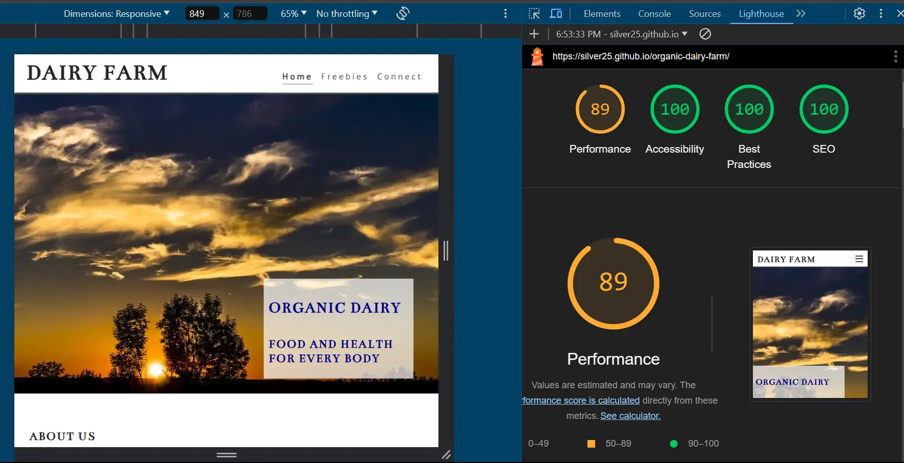

-----

PageSpeed Insights (PSI): https://pagespeed.web.dev/

PageSpeed score for Desktop <b style="color: yellow;">(open here)</b>

PageSpeed Insights (PSI) reports on the user experience of a page on both mobile and desktop devices

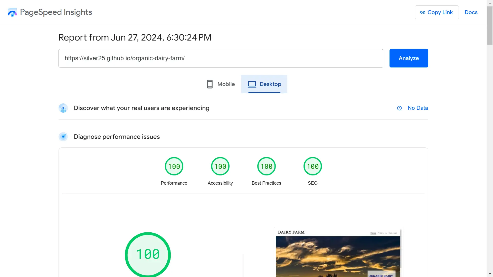

PageSpeed score for Mobile <b style="color: yellow;">(open here)</b>

PageSpeed Insights (PSI) reports on the user experience of a page on both mobile and desktop devices

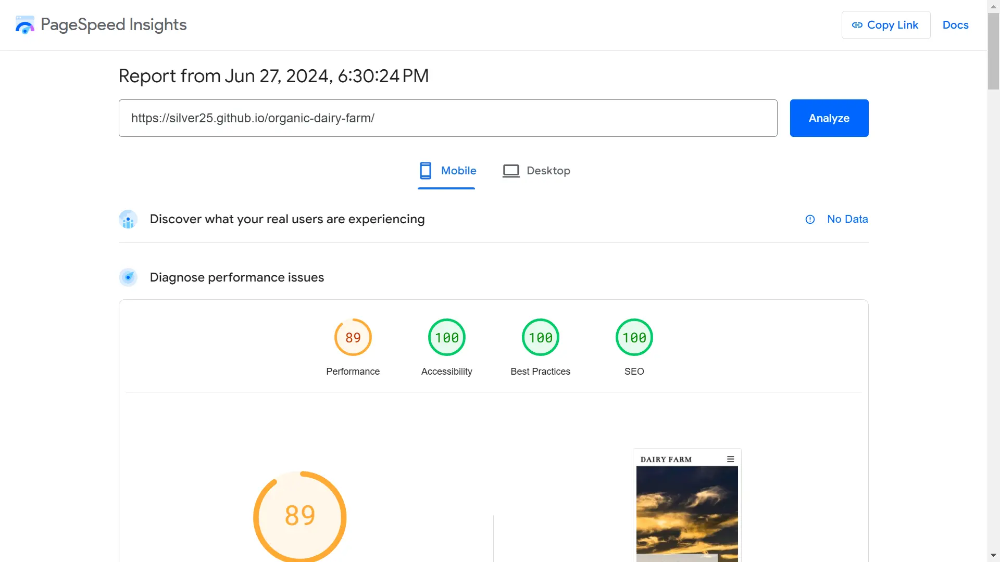

  

-----

## Deployment

### Local Deployment

To test and view HTML5 and CSS3 project locally, a simple server environment needs to be set up on personal computer. This essentially mimics a web hosting service, but runs on private machine. Let's walk through the steps involved...  
- Choose a code editor of your preference like Visual Studio Code, Sublime Text, Atom, or Brackets. These editors provide syntax highlighting and other functionalities for web development.
- Organize your HTML and CSS files in a *folder structure*. Typically, you'll have an index.html file as your main webpage and other HTML files for different sections. CSS files can be in a separate CSS folder. All together can be placed in the *My Documents* subfolder on Windows.
- As HTML and CSS are languages easily interpreted in the browser of choice, once index.html file is created it's content can be displayed opening that file in browser
- For everything to work and display properly attention needs to be on using of *relative path* code structure
- Test the layout and functionality on different browsers (*Portable Browsers*).
- Use the browser's developer tools (*Inspect* or **F12**) to inspect and debug any styling issues.

Local deployment structure image <b style="color: yellow;">(open here)</b>

Local development occurs on personal computer or mobile device, and only available to person who has access to the same computer. No one in outside world can access and view those pages.

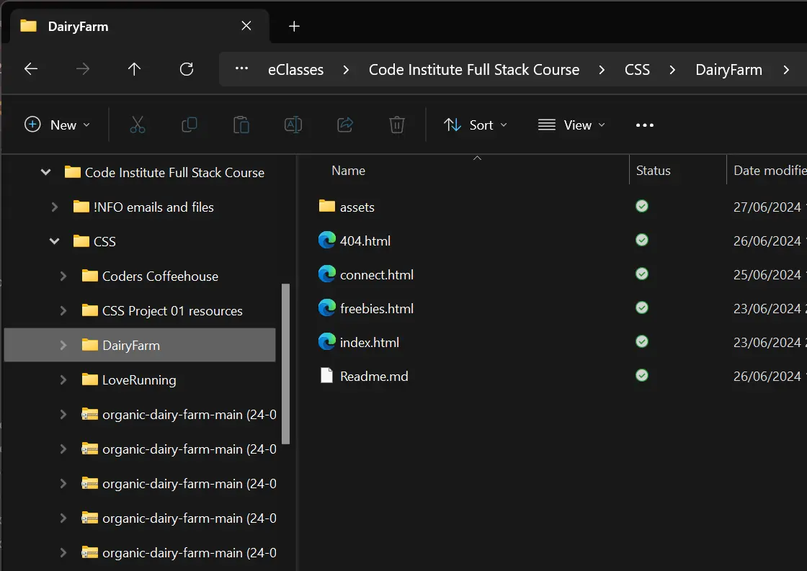

   

Or to simplify if Repository for the project is already created on GitHub all content of the project can be downloaded over the action button and option "Download".

GitGub option to download full project in once <b style="color: yellow;">(open here)</b>

If all of the changes are saved (CTRL+S) and content updated on GitHub (git push) download of full project is available over green button "Code" and option "Download ZIP"

-----

### Cloud Deployment

Here's a step-by-step process for deploying your website on GitHub Pages:  

- **Prepare your Website Files**
  - Build your website files locally using your preferred framework (HTML, CSS, Javascript etc.).
  - Ensure your website has an index.html, index.md, or README.md file, as GitHub Pages looks for this as the entry point.
  - Organize your website files into a clear structure for easy navigation.
- **Create a GitHub Repository**
  - If you don't have one already, create a new account and repository on GitHub.com.
  - Push your website files to the newly created repository using Git commands or the GitHub desktop application.
- **Configure Publishing Source (Using Branch)**
  - Go to your repository settings on GitHub.
  - Navigate to the "*Code and automation*" section and click "*Pages*".
  - Under "*Build and deployment*", choose "*Deploy from a branch*" in the "*Source*" section.
  - Select the branch containing your website files from the "*Branch" dropdown menu. Optionally, choose a specific folder within the branch using the "*Folder" dropdown menu (useful for subdirectory deployments).
  - Click "*Save*" to activate your website deployment.
- **Accessing Your Deployed Website**
  - Once configured, GitHub Pages will automatically build and publish your website.
  - This live site is on the location: *https://silver25.github.io/organic-dairy-farm/*

-----

## Credits

For the fast or more detailed explanation of some part of the code resources to consult:
- https://www.w3schools.com/
- https://css-tricks.com/
- https://developer.mozilla.org/en-US/docs/Web
- https://web.dev/

Used images for Index page  
- Hero image: horizon.webp = by Felix Mittermeier on https://pxhere.com  
- Cow head below paragraphs = by jod67 from https://istock.com  
- Timetables bgr image: panoramic.webp = Open source image from https://publicdomainpictures.net  
- Icons from https://fontawesome.com/v4/icons/ 

Used images for the Freebies page  
- dairy-products.webp = https://www.health.harvard.edu  
- milk-in-glass.webp = https://www.forbes.com  
- organic-milk.webp = https://www.thefrozengarden.com  
- milkshake.webp = https://www.eatingwell.com  
- cheese.webp = https://www.healthline.com/nutrition/healthiest-cheese  
- cheese-pile.webp = https://www.gq.com/story/the-surprising-health-benefits-of-cheese  
- butter-plate.webp = https://blog.providence.org/regional-blog-news  
- sour-cream.webp = https://www.realsimple.com  
- soften-butter.webp = https://cravingcork.ie  
- yogurt.webp = https://cookidoo.co.uk/  
- Coloring book PDF = https://www.supercoloring.com/coloring-pages/tags/farm
- cow-404.webp = by jamesjames2541 from https://istock.com

Used PDF documents on Freebies page for download
- "Recipe eBook" by Kyle Robert Annasenz (https://www.dailysciencefiction.com/)
- "Organic Dairy Farming" by Dan Clavin (https://www.teagasc.ie/)
  
### Text Tools

- Make use of [Google Translate](https://translate.google.com/) online service for translation from Croatian to English language and spelling check.  
- Run text through [AI Paragraph Rewriter](https://ahrefs.com/writing-tools/paragraph-rewriter) online tool to accomplish formal style of writing for translations.  
- Use of the [Grammarly](https://app.grammarly.com/) tool for guidance around the content.  
- Help with basic writing and formatting syntax for this file with help of the [GitHub](https://docs.github.com/)
- Google Font pairing tool (Fonts that go together): [Fontpair](https://www.fontpair.co/all)

### Image Tools

Conversion of the images from JPG file format to WEBP file format:  
- using portable Windows software [IrfanView](https://www.irfanview.com/) with plugin WEBP - (version 4.63, allows IrfanView to read/write WEBP (Weppy Format) files)  
- using online tool [FreeConvert](https://www.freeconvert.com/jpg-to-webp)  

Other Image manipulation tools:
- Creation of Intro display image: https://ui.dev/amiresponsive
- Portable Windows software [IrfanView](https://www.irfanview.com/) for fast transformation
- Wireframe actions accomplished with online tools https://mydraft.cc/ and https://wireframe.cc/
- [Favicon](https://favicon.io) generator

I would like to express gratitude to **[Code Institute](https://codeinstitute.net/ie/)** and **Love Running** project for offering a valuable step-by-step guide that was instrumental in creating the basis for this website.  
Last but not least is big THANKS to my mentor **Rory** for guidance and sugestions through project.

-----

<!-- ########## Gitpod Reminders ##########

To run a frontend (HTML, CSS, Javascript only) application in Gitpod, in the terminal, type:

`python3 -m http.server` [ blue button to click: _Open Browser_. ]
Ctrl + C

$ git add .
$ git commit -m "Description of changes in code"
$ git push
$ git status
$ clear
  
-->